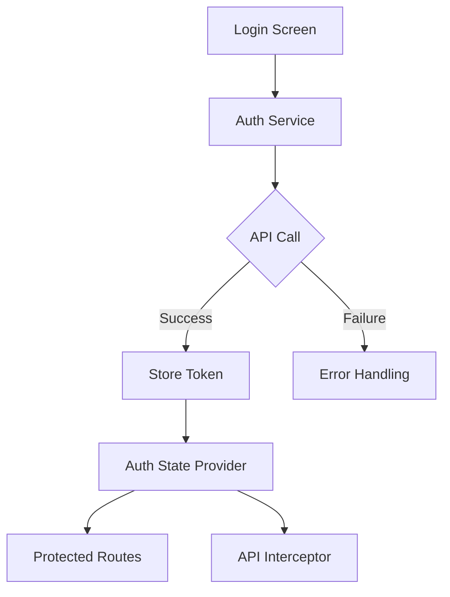

# Flutter Authentication Integration Guide

This guide outlines the implementation plan for integrating login API functionality in the Flutter mobile application.

## Architecture Overview



## Project Structure

```
lib/
├── features/
│   └── auth/
│       ├── data/
│       │   ├── auth_repository.dart
│       │   └── auth_service.dart
│       ├── models/
│       │   ├── user.dart
│       │   └── auth_state.dart
│       ├── providers/
│       │   └── auth_provider.dart
│       └── views/
│           └── login_screen.dart
└── core/
    ├── api/
    │   └── api_client.dart
    └── storage/
        └── secure_storage.dart
```

## Implementation Steps

### 1. Dependencies Setup

Add the following to `pubspec.yaml`:

```yaml
dependencies:
  dio: ^5.0.0
  flutter_secure_storage: ^8.0.0
  flutter_riverpod: ^2.3.0
  freezed: ^2.3.0
  freezed_annotation: ^2.3.0

dev_dependencies:
  build_runner: ^2.3.0
  freezed_generator: ^2.3.0
```

### 2. Authentication Service

The auth service will handle API communication:

```dart
class AuthService {
  final Dio _dio;
  
  Future<AuthResponse> login(String username, String password) async {
    try {
      final response = await _dio.post('/api/auth', data: {
        'username': username,
        'password': password,
      });
      return AuthResponse.fromJson(response.data);
    } on DioError catch (e) {
      throw AuthException.fromDioError(e);
    }
  }
}
```

### 3. Auth Repository

The repository will handle data persistence and business logic:

```dart
class AuthRepository {
  final AuthService _authService;
  final SecureStorage _storage;
  
  Future<void> login(String username, String password) async {
    final response = await _authService.login(username, password);
    await _storage.saveToken(response.token);
  }
  
  Future<bool> isAuthenticated() async {
    final token = await _storage.getToken();
    return token != null;
  }
}
```

### 4. State Management

Using Riverpod for auth state management:

```dart
final authProvider = StateNotifierProvider<AuthNotifier, AuthState>((ref) {
  return AuthNotifier(ref.read(authRepositoryProvider));
});

class AuthNotifier extends StateNotifier<AuthState> {
  final AuthRepository _repository;
  
  AuthNotifier(this._repository) : super(const AuthState.unauthenticated());
  
  Future<void> login(String username, String password) async {
    state = const AuthState.loading();
    try {
      await _repository.login(username, password);
      state = const AuthState.authenticated();
    } catch (e) {
      state = AuthState.error(e.toString());
    }
  }
}
```

### 5. Login Screen

Example login screen implementation:

```dart
class LoginScreen extends ConsumerWidget {
  final _formKey = GlobalKey<FormState>();
  
  @override
  Widget build(BuildContext context, WidgetRef ref) {
    ref.listen<AuthState>(authProvider, (previous, next) {
      next.maybeWhen(
        authenticated: () => Navigator.pushReplacementNamed(context, '/home'),
        error: (message) => ScaffoldMessenger.of(context).showSnackBar(
          SnackBar(content: Text(message)),
        ),
        orElse: () {},
      );
    });
    
    return Scaffold(
      body: Form(
        key: _formKey,
        child: Column(
          children: [
            TextFormField(
              decoration: InputDecoration(labelText: 'Username'),
              validator: (value) => value?.isEmpty ?? true ? 'Required' : null,
            ),
            TextFormField(
              decoration: InputDecoration(labelText: 'Password'),
              obscureText: true,
              validator: (value) => value?.isEmpty ?? true ? 'Required' : null,
            ),
            ElevatedButton(
              onPressed: () {
                if (_formKey.currentState?.validate() ?? false) {
                  // Handle login
                }
              },
              child: Text('Login'),
            ),
          ],
        ),
      ),
    );
  }
}
```

### 6. API Interceptor

Setup Dio interceptor for token management:

```dart
class AuthInterceptor extends Interceptor {
  final SecureStorage _storage;
  
  @override
  Future<void> onRequest(options, handler) async {
    final token = await _storage.getToken();
    if (token != null) {
      options.headers['Authorization'] = 'Bearer $token';
    }
    return handler.next(options);
  }
  
  @override
  Future<void> onError(error, handler) async {
    if (error.response?.statusCode == 401) {
      // Handle token expiration
    }
    return handler.next(error);
  }
}
```

## Security Considerations

1. **Secure Storage**
   - Use Flutter Secure Storage for storing sensitive data
   - Encrypt tokens before storage
   - Clear storage on logout

2. **Token Management**
   - Implement token refresh mechanism
   - Handle token expiration gracefully
   - Secure token transmission

3. **Error Handling**
   - Implement proper error handling for all API calls
   - Show user-friendly error messages
   - Log errors for debugging

4. **Input Validation**
   - Validate all user inputs
   - Sanitize data before sending to API
   - Implement proper form validation

## Testing Strategy

1. **Unit Tests**
   - Test AuthService
   - Test AuthRepository
   - Test AuthNotifier

2. **Widget Tests**
   - Test LoginScreen
   - Test form validation
   - Test error handling

3. **Integration Tests**
   - Test full login flow
   - Test token persistence
   - Test protected routes

## Next Steps

1. Set up project structure and dependencies
2. Implement core authentication functionality
3. Build UI components
4. Add error handling and validation
5. Implement security measures
6. Write tests
7. Perform testing and debugging