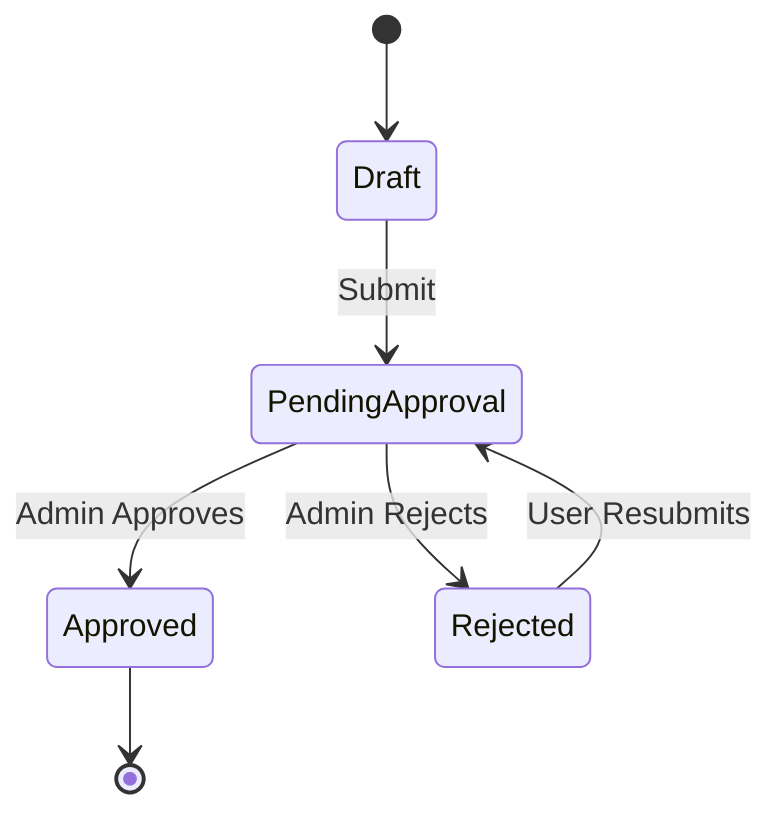

# Report Approval Workflow

## Roles

- **Normal User**: Submits plan and actual reports for their assigned branch (twice daily).
- **Branch Manager**: Can submit reports for their assigned branches and sub-branches.
- **Admin**: Reviews, approves, or rejects reports for all branches.

## Workflow

1. **Submission**

   - User/Branch Manager submits a report (plan or actual) for a branch.
   - Report status: `pending_approval`.

2. **Review**

   - Admin reviews all `pending_approval` reports.
   - Admin can:
     - **Approve**: Status changes to `approved`.
     - **Reject**: Status changes to `rejected`. Admin may add comments.

3. **Resubmission**

   - If rejected, the original submitter can edit and resubmit the report.
   - Status returns to `pending_approval`.
   - Admin reviews again.

4. **Audit Trail**
   - All actions (submit, approve, reject, resubmit) are logged with user, timestamp, and optional comments.

## Permissions Matrix

| Action          | Normal User       | Branch Manager    | Admin |
| --------------- | ----------------- | ----------------- | ----- |
| Submit report   | Own branch        | Assigned/sub      | All   |
| Edit own report | Yes               | Yes               | Yes   |
| Approve report  | No                | No                | Yes   |
| Reject report   | No                | No                | Yes   |
| Resubmit        | Yes (if rejected) | Yes (if rejected) | Yes   |

## Status Transitions

- `draft` → `pending_approval` (on submit)
- `pending_approval` → `approved` (admin approves)
- `pending_approval` → `rejected` (admin rejects)
- `rejected` → `pending_approval` (user resubmits)

## Mermaid Diagram

## Best Practices

- **Audit Logging**: Log every status change with user, timestamp, and comments.
- **Permission Checks**: Enforce role-based access for each action.
- **Branch Scoping**: Branch managers can only act on their assigned branches/sub-branches.
- **UI Feedback**: Only show actions (approve/reject/resubmit) to users with permission.

ere’s a precise diagnosis and what to do next:

1. Your /api/branches endpoint is correct.
   It uses getAccessibleBranches for filtered access.
   The frontend useAccessibleBranches hook calls this endpoint, so your branch dropdown is correct and hierarchical.
2. Your /api/reports endpoint is also correct.
   It gets all accessible branches for the user (using getAccessibleBranches).
   It sets where.branchId: { in: accessibleBranchIds }, so all reports for all sub-branches are included.
3. If you still cannot see or edit reports in sub-branches:
   The most likely cause is your test user (branch manager) is not assigned to the correct parent branch, or your database hierarchy is not set up as expected.
   Alternatively, the frontend may be filtering by a specific branch and not by all accessible branches.
4. Debug Checklist
   A. Check the test user’s assignments:
   Is the branch manager’s branchId set to the parent branch?
   Are there any branchAssignments for this user?
   Are the sub-branches correctly set up with parentId pointing to the parent branch?
   B. Check the frontend branch filter:
   If you select a parent branch in the filter, do you see reports from its sub-branches? (You should only see reports for the selected branch, not its children, unless you select each one.)
   If you want to see all reports for all accessible branches at once, you must either:
   Not filter by a specific branch, or
   Implement a filter option for “All My Branches”.
   C. Check report editing:
   If a report is in a sub-branch, can you open its edit modal as a branch manager? If not, check the logic in your edit button and PATCH request.
5. How to Fix or Improve
   To show all reports for all accessible branches:
   When selectedBranchId is empty or “All”, do not filter by branch, just use all accessible branches.
   To allow editing:
   The backend PATCH already checks if the report’s branch is in the accessible list, so as long as the frontend sends the PATCH request, it should work.
