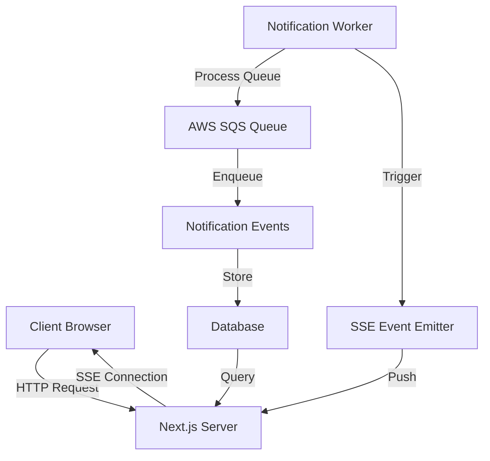

# SSE Integration Plan

This document outlines the plan for integrating Server-Sent Events (SSE) into the application to provide real-time notifications to clients.

## Overview of SSE

Server-Sent Events (SSE) is a server push technology enabling a client to receive automatic updates from a server via an HTTP connection. Unlike WebSockets, SSE is a one-way communication channel from the server to the client, making it ideal for scenarios where clients need to receive real-time updates without necessarily sending data back to the server.

**Benefits of SSE:**

- Simpler than WebSockets for one-way communication
- Built-in reconnection handling
- Works over standard HTTP
- Automatic event parsing
- Lower overhead than polling

## Architecture

The SSE integration will enhance our existing notification system by providing real-time delivery of notifications to clients:



### Components

1. **SSE Handler** (`src/lib/sse/sse-handler.ts`):

   - Manages SSE connections
   - Authenticates clients
   - Sends events to connected clients
   - Handles connection lifecycle

2. **SSE API Route** (`src/app/api/notifications/sse/route.ts`):

   - Establishes SSE connections
   - Authenticates requests
   - Sets up proper headers
   - Registers client with SSE Handler

3. **Notification Worker Integration**:
   - Triggers SSE events when processing notifications
   - Ensures real-time delivery to connected clients

## Implementation Plan

### Phase 1: Core SSE Infrastructure

1. **Create SSE Handler**:

   ```typescript
   // src/lib/sse/sse-handler.ts
   import { NextRequest } from "next/server";

   type Client = {
     id: string;
     userId: string;
     controller: ReadableStreamController<any>;
   };

   class SSEHandler {
     private clients: Map<string, Client> = new Map();
     private static instance: SSEHandler;

     private constructor() {}

     public static getInstance(): SSEHandler {
       if (!SSEHandler.instance) {
         SSEHandler.instance = new SSEHandler();
       }
       return SSEHandler.instance;
     }

     public addClient(userId: string): {
       stream: ReadableStream;
       clientId: string;
     } {
       const clientId = `${userId}-${Date.now()}-${Math.random().toString(36).substring(2, 10)}`;

       // Create a new stream
       const stream = new ReadableStream({
         start: (controller) => {
           this.clients.set(clientId, { id: clientId, userId, controller });
           //console.log(`Client connected: ${clientId} for user ${userId}`);
         },
         cancel: () => {
           this.removeClient(clientId);
         },
       });

       return { stream, clientId };
     }

     public removeClient(clientId: string): void {
       const client = this.clients.get(clientId);
       if (client) {
         //console.log(`Client disconnected: ${clientId} for user ${client.userId}`);
         this.clients.delete(clientId);
       }
     }

     public sendEventToUser(userId: string, event: string, data: any): void {
       const userClients = Array.from(this.clients.values()).filter(
         (client) => client.userId === userId,
       );

       if (userClients.length === 0) return;

       const eventString = `event: ${event}\ndata: ${JSON.stringify(data)}\n\n`;

       userClients.forEach((client) => {
         try {
           client.controller.enqueue(new TextEncoder().encode(eventString));
         } catch (error) {
           console.error(`Error sending event to client ${client.id}:`, error);
           this.removeClient(client.id);
         }
       });
     }

     public sendEventToAll(event: string, data: any): void {
       const eventString = `event: ${event}\ndata: ${JSON.stringify(data)}\n\n`;

       this.clients.forEach((client) => {
         try {
           client.controller.enqueue(new TextEncoder().encode(eventString));
         } catch (error) {
           console.error(`Error sending event to client ${client.id}:`, error);
           this.removeClient(client.id);
         }
       });
     }

     public sendPing(): void {
       this.clients.forEach((client) => {
         try {
           client.controller.enqueue(new TextEncoder().encode(": ping\n\n"));
         } catch (error) {
           console.error(`Error sending ping to client ${client.id}:`, error);
           this.removeClient(client.id);
         }
       });
     }

     public getActiveConnectionsCount(): number {
       return this.clients.size;
     }

     public getActiveConnectionsCountByUser(userId: string): number {
       return Array.from(this.clients.values()).filter(
         (client) => client.userId === userId,
       ).length;
     }
   }

   // Start a ping interval to keep connections alive
   setInterval(() => {
     SSEHandler.getInstance().sendPing();
   }, 30000); // Send ping every 30 seconds

   export default SSEHandler.getInstance();
   ```

2. **Create SSE API Route**:

   ```typescript
   // src/app/api/notifications/sse/route.ts
   import { NextRequest, NextResponse } from "next/server";
   import { getServerSession } from "next-auth";
   import { authOptions } from "@/lib/auth/options";
   import sseHandler from "@/lib/sse/sse-handler";
   import { AuthError } from "@/lib/errors/app-errors";
   import { handleApiError } from "@/lib/errors/error-handler";

   export async function GET(req: NextRequest) {
     try {
       // Authenticate the user
       const session = await getServerSession(authOptions);

       if (!session?.user?.id) {
         throw new AuthError("Authentication required for SSE connection");
       }

       // Create SSE connection
       const { stream, clientId } = sseHandler.addClient(session.user.id);

       // Set headers for SSE
       const headers = {
         "Content-Type": "text/event-stream",
         "Cache-Control": "no-cache, no-transform",
         Connection: "keep-alive",
         "X-Accel-Buffering": "no", // Disable buffering for Nginx
       };

       // Send initial connection event
       const encoder = new TextEncoder();
       const readable = stream.pipeThrough(
         new TransformStream({
           start(controller) {
             controller.enqueue(
               encoder.encode(
                 `event: connected\ndata: {"clientId":"${clientId}"}\n\n`,
               ),
             );
           },
         }),
       );

       return new NextResponse(readable, { headers });
     } catch (error) {
       return handleApiError(error);
     }
   }
   ```

### Phase 2: Notification Worker Integration

1. **Update Notification Worker**:

   - Modify the notification worker to trigger SSE events when processing notifications
   - Add SSE event emission to the notification processing pipeline

2. **Create SSE Event Emitter**:

   ```typescript
   // src/lib/sse/event-emitter.ts
   import sseHandler from "./sse-handler";

   export async function emitNotificationEvent(
     userId: string,
     notification: any,
   ): Promise<void> {
     sseHandler.sendEventToUser(userId, "notification", {
       id: notification.id,
       type: notification.type,
       title: notification.title,
       message: notification.message,
       createdAt: notification.createdAt,
     });
   }

   export async function emitSystemEvent(
     userId: string,
     eventType: string,
     data: any,
   ): Promise<void> {
     sseHandler.sendEventToUser(userId, eventType, data);
   }
   ```

3. **Integrate with Notification Processing**:

   ```typescript
   // In notification worker processing function
   import { emitNotificationEvent } from "@/lib/sse/event-emitter";

   async function processNotification(message) {
     // Existing notification processing code...

     // After creating the in-app notification
     await emitNotificationEvent(notification.userId, notification);

     // Continue with existing processing...
   }
   ```

### Phase 3: Client-Side Integration

1. **Create SSE Client Hook**:

   ```typescript
   // src/hooks/useSSE.ts
   import { useEffect, useState } from "react";
   import { useSession } from "next-auth/react";

   type SSEOptions = {
     onNotification?: (data: any) => void;
     onConnected?: (data: any) => void;
     onError?: (error: any) => void;
   };

   export function useSSE(options: SSEOptions = {}) {
     const { data: session } = useSession();
     const [connected, setConnected] = useState(false);
     const [error, setError] = useState<Error | null>(null);

     useEffect(() => {
       if (!session?.user) return;

       let eventSource: EventSource | null = null;

       try {
         // Create EventSource connection
         eventSource = new EventSource("/api/notifications/sse");

         // Connection opened
         eventSource.addEventListener("connected", (e: any) => {
           setConnected(true);
           if (options.onConnected) {
             options.onConnected(JSON.parse(e.data));
           }
         });

         // Listen for notifications
         eventSource.addEventListener("notification", (e: any) => {
           if (options.onNotification) {
             options.onNotification(JSON.parse(e.data));
           }
         });

         // Handle errors
         eventSource.onerror = (e) => {
           setError(new Error("SSE connection error"));
           if (options.onError) {
             options.onError(e);
           }

           // Try to reconnect if connection is closed
           if (eventSource && eventSource.readyState === EventSource.CLOSED) {
             eventSource.close();
           }
         };
       } catch (err) {
         setError(err instanceof Error ? err : new Error("Unknown SSE error"));
         if (options.onError) {
           options.onError(err);
         }
       }

       // Cleanup on unmount
       return () => {
         if (eventSource) {
           eventSource.close();
         }
       };
     }, [
       session,
       options.onNotification,
       options.onConnected,
       options.onError,
     ]);

     return { connected, error };
   }
   ```

2. **Integrate with Notification Context**:

   ```typescript
   // src/contexts/NotificationContext.tsx
   import { useSSE } from "@/hooks/useSSE";

   export function NotificationProvider({ children }) {
     // Existing notification context code...

     // Add SSE integration
     useSSE({
       onNotification: (data) => {
         // Update notification state with new notification
         setNotifications((prev) => [data, ...prev]);
         setUnreadCount((prev) => prev + 1);

         // Show toast or other UI notification
         toast({
           title: data.title,
           description: data.message,
           status: "info",
         });
       },
       onError: (error) => {
         console.error("SSE connection error:", error);
       },
     });

     // Rest of the provider implementation...
   }
   ```

## Performance Considerations

1. **Connection Limits**:

   - Implement connection limits per user to prevent resource exhaustion
   - Add monitoring for connection counts

2. **Message Batching**:

   - Batch notifications when multiple are generated in a short time
   - Implement debouncing for high-frequency events

3. **Reconnection Strategy**:

   - Use exponential backoff for client reconnection attempts
   - Implement server-side session tracking to resume connections

4. **Load Balancing**:
   - Consider sticky sessions for load balancers
   - Implement Redis or similar for cross-instance SSE in clustered environments

## Testing Strategy

1. **Unit Tests**:

   - Test SSE handler methods
   - Test event emission functions
   - Test client hook with mocked EventSource

2. **Integration Tests**:

   - Test end-to-end notification flow with SSE
   - Test reconnection scenarios
   - Test with multiple simultaneous connections

3. **Load Testing**:
   - Test with high connection counts
   - Test with high message throughput
   - Measure memory and CPU usage under load

## Rollout Plan

### Phase 1: Development and Testing (Week 1-2)

- Implement core SSE infrastructure
- Create unit and integration tests
- Test in development environment

### Phase 2: Limited Production Testing (Week 3)

- Deploy to production with feature flag
- Enable for a small subset of users
- Monitor performance and error rates

### Phase 3: Full Rollout (Week 4)

- Enable for all users
- Continue monitoring
- Gather feedback and make adjustments

### Phase 4: Optimization (Week 5+)

- Analyze performance data
- Implement optimizations
- Consider scaling strategies if needed

## Monitoring and Maintenance

1. **Key Metrics to Monitor**:

   - Connection count (total and per user)
   - Message delivery rate and latency
   - Error rates
   - Resource usage (memory, CPU)

2. **Logging**:

   - Log connection events
   - Log message delivery events
   - Log errors with context

3. **Alerting**:
   - Set up alerts for high error rates
   - Set up alerts for connection spikes
   - Set up alerts for resource usage thresholds
